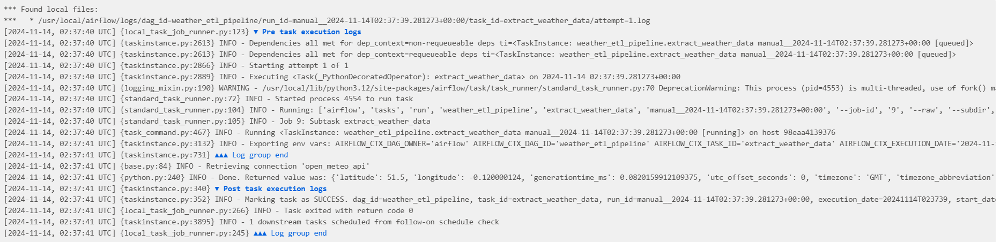
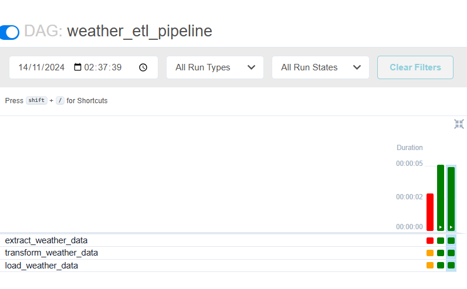

# ETL Pipeline with Apache Airflow and PostgreSQL

This project demonstrates a data engineering pipeline using Apache Airflow, PostgreSQL, and ETL processes. The pipeline is orchestrated with Airflow, utilizing PostgreSQL for data storage and ETL tasks to move and transform data from source to target systems.

## Description

This ETL pipeline is designed to automate data extraction, transformation, and loading using Apache Airflow. It schedules and monitors data workflows, leveraging PostgreSQL for persistent storage. The pipeline architecture facilitates data processing by breaking down the ETL tasks into modular components managed by Airflow's DAGs (Directed Acyclic Graphs). Each task within the DAG performs a specific step in the ETL process, ensuring data integrity and ease of debugging.

## Project Structure

- **`airflow/`**: Contains the Airflow DAGs and configuration files that define and manage the ETL pipeline.
  - **Extraction**: The ETL pipeline extracts raw data from various sources, such as APIs or databases. This data is collected as-is without modifications.
  - **Transformation**: The extracted data is processed to ensure it meets the necessary format and quality standards. Transformations may include cleaning, filtering, aggregation, or enrichment, preparing the data for analysis.
  - **Loading**: Finally, the transformed data is loaded into the PostgreSQL database. This step ensures the data is stored in a structured, queryable format for further analysis.


## Prerequisites

1. **Docker** and **Docker Compose** - Used to deploy Airflow and PostgreSQL services.
2. **Python 3.7+** - Required for Airflow.

## Setup Instructions

1. **Clone this repository**:
   ```bash
   git clone https://github.com/yourusername/ETLPipeline
   cd ETLPipeline
   ````
   
2. **Run Docker Compose**:
   ```bash
   docker-compose up
   ````




   

